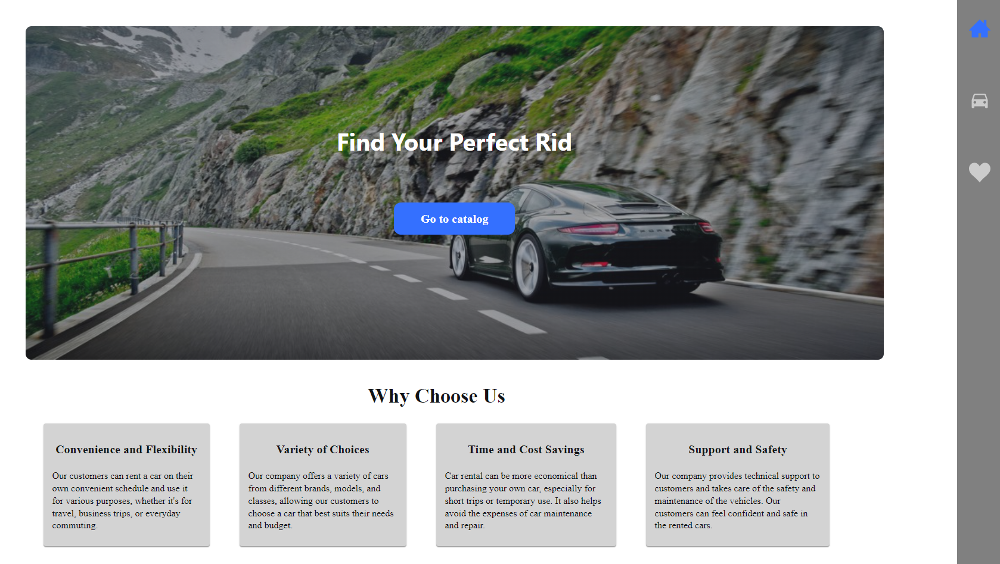
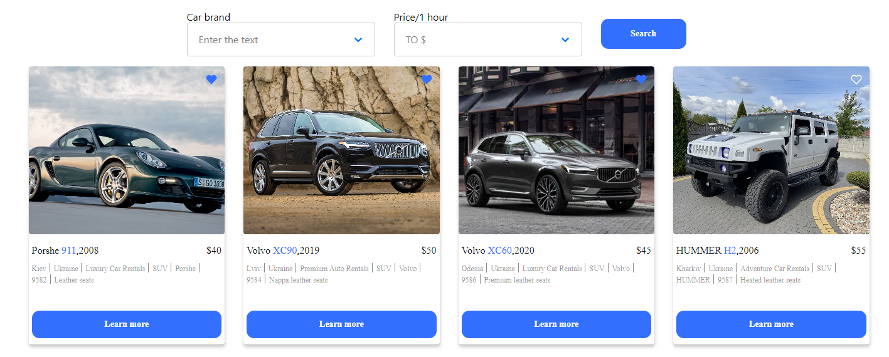
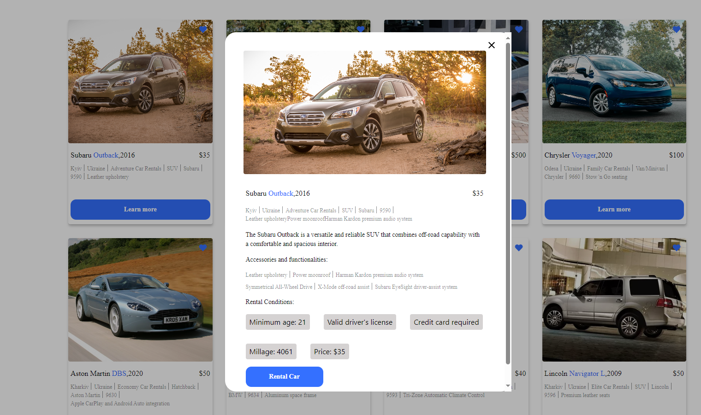

# Travel Car Sharing

The Travel Car Sharing application is a web application designed for convenient
and flexible car rentals. This application provides users with the ability to
select, book, and rent a car according to their convenient schedule and for
various purposes, such as traveling, business trips, or everyday commuting.

## Table of Contents

1. [Usage](#Usage)
2. [Technologies](#Technologies)

## Usage

On the home page, you can see the advantages of a company that rents cars and
also go to the car catalog.Additionally, for easy navigation between pages,
there is a sidebar on the right side. This sidebar allows users to navigate
throughout the application's pages conveniently.

On the catalog page, you can view all available cars, read their detailed
descriptions, add them to your favorites, or place an order. You can also filter
the catalog by car make, pricing, or mileage.

On the favorites page, you can see the cars you've previously added, view
detailed information about them, and place an order.

## Technologies

The "Travel Car Sharing" project was developed using the following technologies:

- **Frontend:** HTML,React.js
- **State Management:** Redux
- **Build and Deployment:** Create React App (CRA)
- **Version Control:** Git, GitHub
- **Development Environment:** Visual Studio Code
